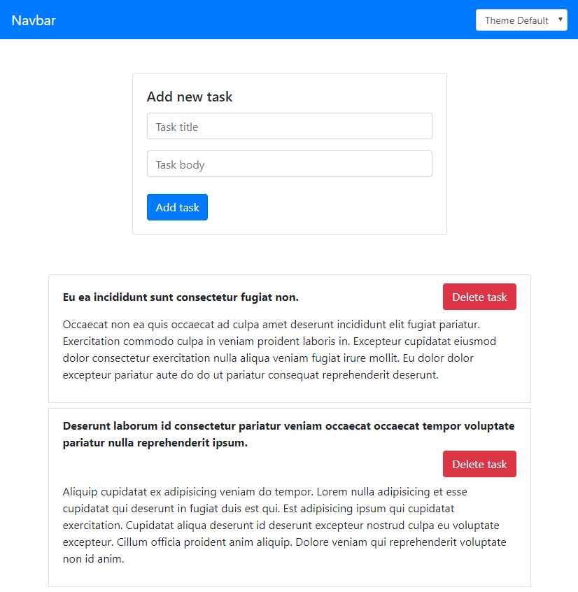

# todo-app
## Todo List on Vue.js

## See [DEMO](https://volkovva.github.io/todo-app-vue/)


## Project setup
```
yarn install
```
### Compiles and hot-reloads for development
```
yarn serve
```
### Compiles and minifies for production
```
yarn build
```